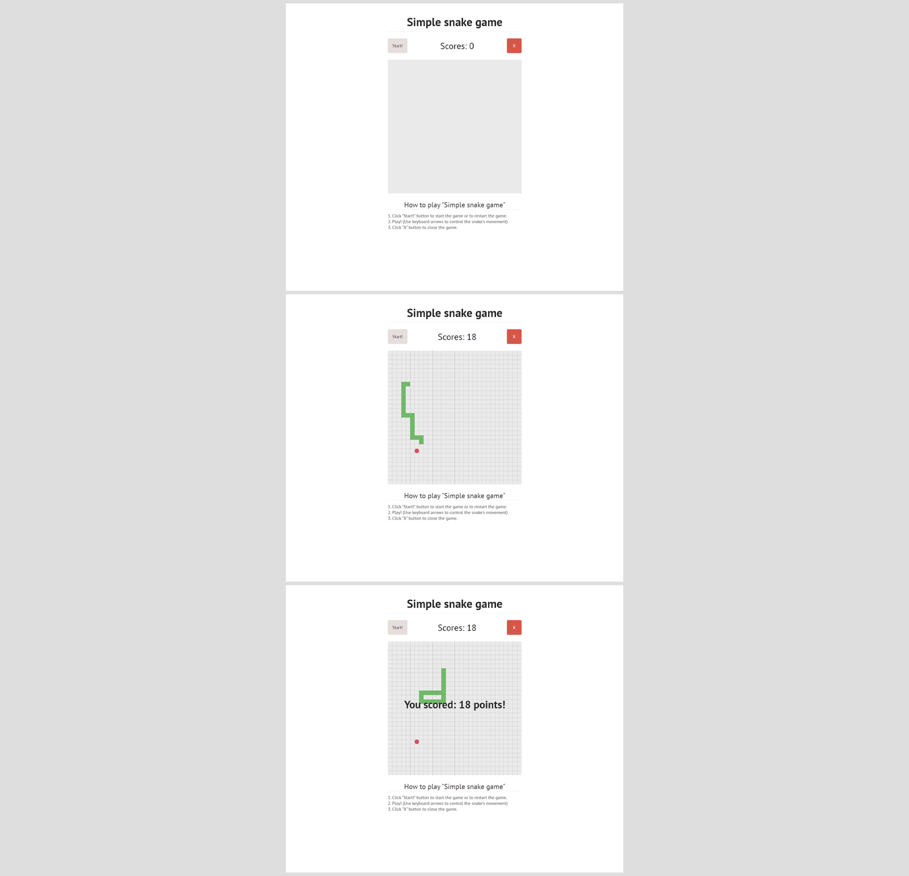

# Игра на JavaScript - "Змейка"

Проект выполнен в рамках обучения на курсе "Профессия Frontend-Разработчик" в онлайн-школе "Айтилогия".

## Внешний вид

## Выполненные задачи:
- Практика работы с JavaScript Canvas;
- Практика применения ООП-подхода для создания игры;
- Реализация логики и механики игры;

## Используемые технологии:
* HTML
* CSS
* JavaScript
* JavaScript Canvas